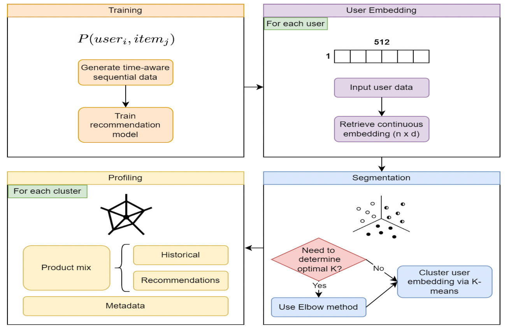
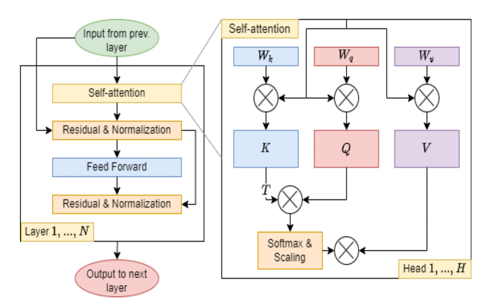

# Code for the paper *Sequential Banking Products Recommendation and User Profiling in One Go* submitted at ICAIF'22.

|  End-to-end pipeline   |  Self-attention model  |
|:----------------------:|:----------------------:|
|  |  |

## Dataset preparation

The Santander products recommendation dataset used in our experiments can be downloaded from [here](https://www.kaggle.com/c/santander-product-recommendation/data?select=train_ver2.csv.zip).
In particular, what we need is the file `train_ver2.csv` which we rename to `train.csv` can put in the folder `data`.

The whole dataset contains hundreds of thousands of users data along a timespan of 17 months. However, we can reduce the dimension of the dataset so to use only a **subsample** of the total users.
```
python subsample_data.py --input_file "data/train.csv" --sample_size 20000 --min_data_points 17
```
`sample_size` is the number of users we want to subsample from the full dataset (input `None` if you want to use the full data), and `min_data_points` is used to filter users having less than `min_data_points` records (ignore it if you don't want to filter).
This process will generate the file `data/train_reduced.csv`.

## Train our Transformer model

The code relative to our model is stored in the directory `model`.
The file `transformer.py` implements the transformer while the file `transformer_model.py` handles the data preprocessing, training and testing.

To begin with, let's preprocess the data.
```
python model/transformer_model.py --save_data --no_load_data --no_train
```
This command creates a file `data.npz` stored in the folder `data` so that next time the preprocessed data can be immediately loaded.

Next, let's train the model for 100 epochs with a warm-up learning rate for the first 10 epochs.
```
python model/transformer_model.py --save_weights --epochs 100 --warmup_epochs 10
```

If we want only to test it, we can simply use the following.
```
python model/transformer_model.py --load_weights --no_train
```

To evaluate the model on the full set of metrics you can run the file `evaluation.py`
```
python model/evaluation.py
```
Default evaluation is on acquisition, but you can evaluate the model on the items ownership task adding the `--ownership` argument.
```
python model/evaluation.py --ownership
```

## Train XGBoost

First, split the dataset into separated train and a test set. We can do this by simply running the following command.
```
python split_train_test_set.py --input_file data/train_reduced.csv
```
It will generate two files: `data/train_split.csv` and `data/test_split.csv` corresponding to train and test set respectively.
`data/train_split.csv` contains the items owned during the first `N-1` timestamps while `data/test_split.csv` contains the items owned at the last timestamp and will be used for evaluation.

Once obtained the files `data/train_split.csv` and `data/test_split.csv`, run the following script to train the XGB model.
This model has been taken from [Kaggle](https://www.kaggle.com/sudalairajkumar/when-less-is-more).
```
python xgb_model/xgb_model.py --train_file "data/train_split.csv" --test_file "data/test_split.csv"
```
The recommendations will be stored in the file `data/rec_xgb.csv`. 
More insights about this model can be found [here](https://www.kaggle.com/c/santander-product-recommendation/discussion/25579).

Next, use the following commands to compute the metrics.
```
python xgb_model/results.py --predictions data/rec_xgb.csv --ground_truth data/test_split.csv
```
**Note**: Since the XGB model is designed to predict only new items (acquisition).

## Train Amazon Personalize (AP)

Firstly, we need to create the **user dataset** and the **user-item interactions dataset** as required by Amazon Personalize.
Note that those files should follow a specific format defined [here](https://docs.aws.amazon.com/personalize/latest/dg/how-it-works-dataset-schema.html).
Moreover, each user can have at most 5 features [(source)](https://docs.aws.amazon.com/personalize/latest/dg/how-it-works-dataset-schema.html). Consequently, should be used any feature selection algorithm to estimate features’ importance and select the 5 most useful ones [(source)](https://medium.com/genifyai/banking-products-recommendation-engine-what-we-learnt-building-our-minimum-viable-product-mvp-7097a52bb413). We don't need the items dataset since our items don't have any feature.
```
python amazon_personalize/AP_preprocess.py --input_file "data/train_split.csv" \
                                            --output_user_data "data/users_data.csv"  \
                                            --output_interactions_data "data/interactions_data.csv" \
```
This process will generate the user dataset `data/users_data.csv` and the user-item interactions dataset `data/interactions_data.csv`.

**Note**: To get performance metrics, Amazon Personalize splits the input interactions data by randomly selecting 90% of users and their related interactions as training data and the other 10% as testing data.
The solution version is then created using the training data. Afterwards, the solution version is given the oldest 90% of each user's testing data as input, and the recommendations it generates are compared against the real interactions given by the most recent 10% of testing data [(source)](https://docs.aws.amazon.com/personalize/latest/dg/recording-events.html).
However, we are going to compute model's metrics on our own test set so to compare its performance against other existing models.

The last file we need to create is the json file used to inform AmazonPersonalize about which users to generate recommendations.
The json file format is specified at [(link)](https://docs.aws.amazon.com/personalize/latest/dg/recommendations-batch.html).
```
python amazon_personalize/make_input_json.py --input_file "data/users_data.csv"
```
It will generate the file `amazon_personalize/input_aws.json`.

The next steps will guide us to upload our data on AWS and train a model (solution version) on Amazon Personalize:
- Upload `data/users_data.csv`and `data/interactions_data.csv` in an Amazon S3 bucket [(link)](https://docs.aws.amazon.com/personalize/latest/dg/data-prep-upload-s3.html). The relative schema of both datasets has already been created and can be found in `data/users_schema.json` and `data/interactions_schema.json` respectively [(link)](https://docs.aws.amazon.com/personalize/latest/dg/how-it-works-dataset-schema.html).
- Create the **User** dataset and **User-item interaction** dataset from the files `data/users_data.csv`and `data/interactions_data.csv` respectively [(link)](https://docs.aws.amazon.com/personalize/latest/dg/data-prep-importing.html). 
- Create a solution version and make sure the recipe you select makes use of the additional features derived from contextual metadata so to exploit also the User dataset, and that it belongs to the category `User personalization` (e.g. `aws-hrnn-metadata`)[(link)](https://docs.aws.amazon.com/personalize/latest/dg/training-deploying-solutions.html).
- Now we may want the model to make predictions on our test set. Firstly, upload `amazon_personalize/input_aws.json` to the S3 bucket. Then, we need to create a **batch inference job** specifying the path of the file we have just uploaded and provide the S3 prefix of the output data [(link)](https://docs.aws.amazon.com/personalize/latest/dg/recommendations-batch.html). 
- Once the batch inference job has completed its process, we can download the `.json.out` file containing the predicted recommendations and put it in the `data` folder.

Finally, use the following command to compute the final metrics on items acquisition.
```
python amazon_personalize/results.py --predictions data/input_aws.json.out --ground_truth data/test_split.csv
```
Considering the fact that the model predicts both items ownership and acquisition, we may also want to obtain the metrics relative to the predictions of both the owned and acquired items.
```
python amazon_personalize/results.py --predictions data/input_aws.json.out --ground_truth data/test_split.csv --ownership
```


## Results on items ownership
| Model                      | Prec1  | Prec5 | Prec10 | Rec1 | Rec5 | Rec10 | MRR20 | NDCG20 |
|----------------------------|--------|-------|-------|-------|------|-------|-------|--------|
| Our model                  | **0.9920**| **0.3537**| **0.1875** | **0.7560** | **0.9836** | **0.9990** | **0.9956**| **0.9961**|
| Amazon Personalize         | 0.9622| 0.2825| 0.1664 | 0.7397| 0.8865|0.9571 | 0.9435| 0.9435|

## Results on items acquisition
| Model                      | Prec1  | Prec5 | Prec10 | Rec1 | Rec5 | Rec10 | MRR20 | NDCG20 |
|----------------------------|--------|-------|-------|-------|------|-------|-------|--------|
| Our model                  | **0.9891**| **0.4022**| **0.2157** |**0.6975**|**0.9764**|0.9979| **0.9937**| **0.9941**|
| Xgboost                    | 0.6887| 0.2449| 0.1285 | 0.6062|0.9440|0.9866| 0.8054| 0.8556|
| Amazon Personalize         | 0.4653| 0.1491| 0.0935 |0.4183|0.6396|0.7869| 0.5788| 0.6505|

## Clustering

You can run the clustering algorithm with the command:
```
python analyze_embedding.py
```


## Cite us

TODO
